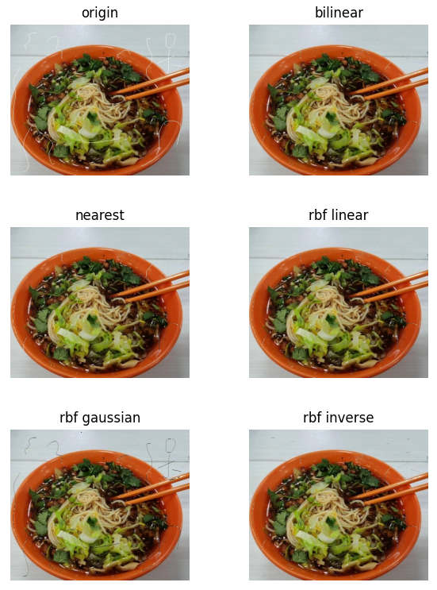
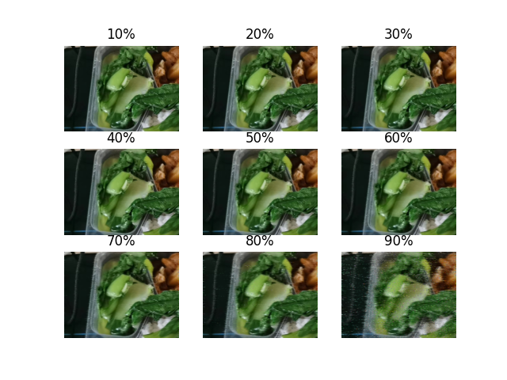

# Image Interpolation

Methods:

- Nearest neighbor interpolation
- Bilinear interpolation
- RBF Interpolation:
  - linear
  - gaussian
  - inverse multi-quadratic

Designated criteria:

- MSE
- PSNR
- SSIM

## Task #1

- words covering
- random scribbles

修改 `main.py` 154行读入的损伤图片路径，运行`main.py`即可

## Task #2

- Missing pixels from 10% to 90%

调用 `task2.py` 的 `miss_gen()` 生成缺失像素的图片

然后运行 `task2.py` 即可得到结果

`plot.py` 用来画曲线图

